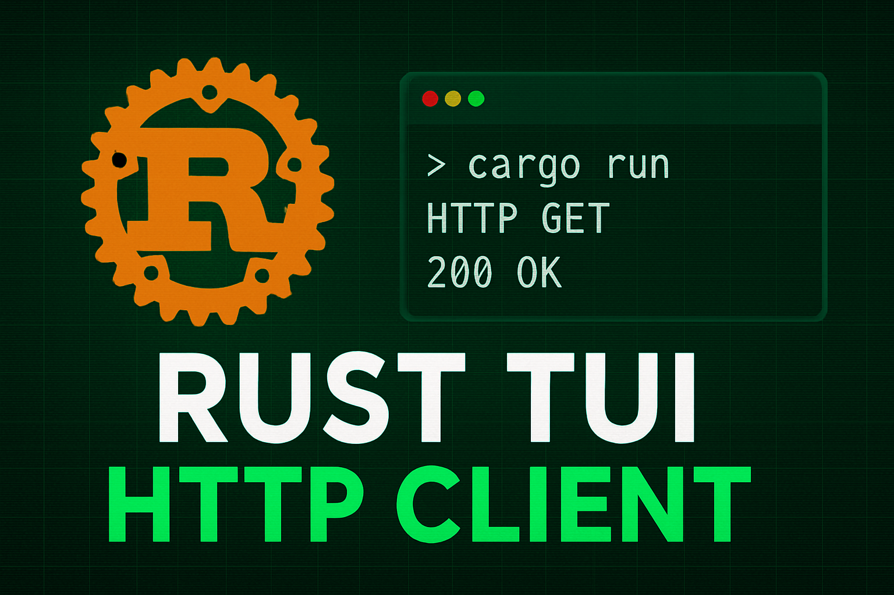

# Rust TUI HTTP Client

A lightweight and fun **Terminal User Interface (TUI)** app built with [ratatui](https://github.com/ratatui-org/ratatui) and [crossterm](https://github.com/crossterm-rs/crossterm).
It allows you to create, send, and manage HTTP requests right inside your terminal.

---

## ✨ Features
- 📜 **Request Management** – Add, view, and organize HTTP requests.
- 🌐 **HTTP Methods** – Supports GET, POST, PUT, DELETE (and more soon).
- 🎨 **Color-coded UI** – Requests are styled based on their HTTP method.
- 📬 **Send Requests** – Quickly send and view responses without leaving the terminal.
- 🖥️ **Minimalist UI** – Split panels for requests, responses, and details.

---

## 🚀 Demo
[](https://youtu.be/hYra8kAZ_M0)

---

## 🛠️ Installation
Make sure you have Rust installed. If not, [install Rust](https://www.rust-lang.org/tools/install).

```bash
# Clone the repo
git clone https://github.com/minatsilvester/hedwig
cd hedwig

# Run in debug mode
cargo run
